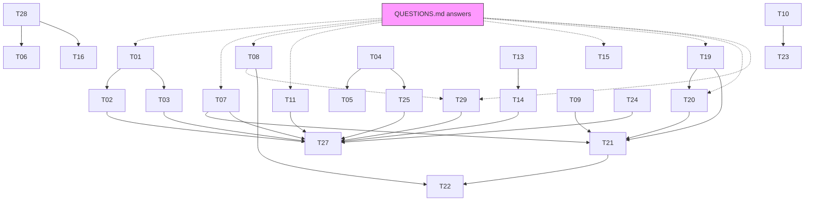

# Shimura Curves LMFDB — Ticket Board

Goal: produce and ship Shimura-curve data for the LMFDB. Two repos:

- **`~/claude/ShimCurve`** — Magma library (enhanced level structures on quaternion orders). Fork lineage: `origin` = roed-math/ShimCurve, `upstream` = assaferan/ShimCurve. Work happens on `main` unless a ticket says otherwise; make a local branch `ticket/T##-slug` per ticket.
- **`~/claude/lmfdb`** — LMFDB webserver, branch `shimura_curves` (module `lmfdb/shimura_curves/`).

Mathematical framework: enhanced representations, Laga–Schembri–Shnidman–Voight, [arXiv:2308.15193](https://arxiv.org/abs/2308.15193) §3.5. A dedicated preprint may arrive; until then **QUESTIONS.md** is the channel for mathematical decisions — David answers there.

## How to work a ticket (agent protocol)

0. **Get an isolated worktree** (see *Parallel agents* below). Never run two agents in one checkout.
1. **Claim**: edit the ticket's frontmatter: `status: in-progress`, `owner: <your session/agent name>`. Do not work a ticket someone else owns. The ticket files live in `~/claude/lmfdb/shimcurve_tickets/` (absolute path — this folder is **not** inside any worktree; always edit it there, never a copy).
2. **Check questions**: if the ticket lists `questions:` that are unanswered in QUESTIONS.md, do only the parts that don't need the answer; if fully blocked, set `status: blocked` and say why in the Log.
3. **Work**: follow the ticket's steps. Log important findings/decisions in the ticket's `## Log` section (date + short note). Tickets are the shared memory between agents — keep them current.
4. **Verify**: run the ticket's acceptance criteria. For ShimCurve changes, always run the regression suite (below).
5. **Finish**: set `status: review` (David reviews) or `done` if criteria are fully met and verified. Never delete a ticket.

Board state at a glance: `grep -H "^status:" ~/claude/lmfdb/shimcurve_tickets/T*.md`

### Hard rules

- **Never push** to any GitHub remote, and never open/edit PRs, without explicit approval from David in-session. Local commits on ticket branches are fine and encouraged.
- **Never write to any remote database.** The devmirror is read-only anyway; production uploads are done by David. Tickets that "upload" data end at: validated file + exact load commands written into the ticket.
- Don't edit files under `data/` by hand — regenerate them via the code (exception: one-off migration scripts that write **new** files).
- The lmfdb repo branch `shimura_curves` has active collaborator traffic (stevehuang235, assaferan). Before large frontend edits, check `git log --oneline -10` for drift and note it in the Log.
- **Labels are not yet reproducible (T29).** Two runs of the same generation code assign `a`/`b` classes differently. Until T29 lands, any `update_from_file` staged **keyed by label** is unsafe — it can attach data to the wrong curve. Compute and stage freely, but mark such artifacts `PROVISIONAL — pending T29` in your Log and do not present them as loadable.
- **Run Magma from the repo root** (`cd <worktree> && magma`, then `AttachSpec("spec");`) — *not* from the parent directory, despite what README.md currently says. Writers disagree about cwd (T28); from the repo root the current main pipeline writer lands correctly in `<repo>/data/`. If your ticket runs `EnumerateO`/`EnumerateOmu`/`PrepPictureDataH`, read T28 first — those still assume the parent dir and will escape your worktree.

## Parallel agents: use git worktrees, not clones

One checkout can only have one branch checked out, so N agents in `~/claude/ShimCurve` would fight over `HEAD` and over `data/` (several tickets regenerate the same files). Worktrees give each agent its own directory and branch while **sharing one object store** — so branches an agent creates are immediately visible from the main checkout (`git -C ~/claude/ShimCurve branch -a`, `git log ticket/T07-…`), with no cross-repo fetching. Clones would isolate too, but then reviewing/merging means fetching between local repos for no benefit. The repo is 29 MB, so a worktree costs nothing.

Verified working (2026-07-16): a worktree of `main`, `AttachSpec("spec")` from the worktree root, and a real `WriteHeaderAndSubgroupsDataToFile` run — output landed in the worktree's own `data/genera-tables/`, main checkout untouched.

```bash
# create (ABSOLUTE path — `git -C repo worktree add ./x` resolves relative to the REPO, not your cwd)
git -C ~/claude/ShimCurve worktree add /Users/roed/claude/shim-wt/T07 -b ticket/T07-gerbiness

# work
cd /Users/roed/claude/shim-wt/T07 && magma        # then: AttachSpec("spec");

# when done: the branch persists in the main repo after removing the worktree
git -C ~/claude/ShimCurve worktree remove /Users/roed/claude/shim-wt/T07
git -C ~/claude/ShimCurve worktree list          # audit what's live
```

Notes:
- Same for the lmfdb repo (T24, T25): `git -C ~/claude/lmfdb worktree add /Users/roed/claude/lmfdb-wt/T24 -b ticket/T24-frontend`. The ticket board is untracked, so it does **not** appear in lmfdb worktrees — edit it at its absolute path.
- `cmfdata.txt` is gitignored (T13): each worktree needs its own copy or a symlink to a shared one.
- 16 cores, and Magma is single-threaded per process — 4–6 concurrent heavy generation runs is a sane ceiling; the hour-long jobs (T06, T07, T21, T23) should not all run at once.
- Two agents must not both run generation for the same (D, deg, N) even in separate worktrees — they'd produce conflicting data files to reconcile later. The ticket table's dependency column is the source of truth for what's safe to overlap.

### Environment cheatsheet

- **Magma**: `/Applications/Magma/magma`. The library must be attached from the directory **above** the repo: `cd ~/claude && magma` then `AttachSpec("ShimCurve/spec");`. Batch: `cd ~/claude/ShimCurve && magma -b tests/run_quick.m`.
- **Tests**: `tests/run_quick.m` (safe). `tests/run_all.m` needs `../CHIMP/CHIMP.spec` which is **not installed** — skip `regression_mod2_image.m` or install [CHIMP](https://github.com/edgarcosta/CHIMP) first.
- **Read-only DB (devmirror)**: `PGPASSWORD=lmfdb psql -h devmirror.lmfdb.xyz -p 5432 -U lmfdb -d lmfdb`. Mixed-case columns need quotes: `"discB"`, `"discO"`, `"Glabel"`.
- **Python DB interface**: `sage -python`, with `sys.path.insert(0, '/Users/roed/claude/lmfdb')`, then `from lmfdb import db` (connects read-only). Plain `python3` lacks psycodict.
- **LMFDB dev server**: `cd ~/claude/lmfdb && sage -python start-lmfdb.py --debug` → http://localhost:37777/ShimuraCurve/Q/.
- **File formats**: postgres-copy files have 3 header lines (column names, postgres types, blank), then rows. Two writers exist today: 68-column `?`-separated (`WriteHeaderAndSubgroupsDataToFile`, enumerate-H.m) and 70-column `|`-separated (`X0DNdata`, tablesX0DN.m). Nulls are `\N`, booleans `T`/`F` (postgres accepts `t`/`f`; keep case consistent with existing files).

## Tickets

| ID | Title | Tier | Priority | Depends on | Questions |
|----|-------|------|----------|-----------|-----------|
| [T28](T28-path-conventions.md) | **Normalize file-path conventions (do first)** | 0 | P0 | — | — |
| [T29](T29-label-determinism.md) | **Make labels deterministic (blocks regeneration+reload)** | 1 | P0 | — | Q15 |
| [T01](T01-legacy-label-map.md) | Decode legacy model/point labels; build old→new map | 0 | P0 | — | Q1 |
| [T02](T02-upload-models.md) | Relabel + stage models upload; create modelmaps/teximages tables | 0 | P0 | T01 | Q1 |
| [T03](T03-upload-points.md) | Relabel + stage rational-points upload | 0 | P0 | T01 | Q1 |
| [T04](T04-unify-writers.md) | Unify the two table writers on one canonical schema | 0 | P0 | — | — |
| [T05](T05-stale-readers.md) | Fix/remove stale readers, README data section, roundtrip test | 0 | P1 | T04 | — |
| [T06](T06-quaternion-order-hygiene.md) | quaternion-orders data hygiene (header/area/disc semantics/row drift) | 0 | P1 | — | Q3, Q14 |
| [T07](T07-fix-gerbiness.md) | Fix gerbiness computations (upstream issue #6) | 1 | P0 | — | Q2 |
| [T08](T08-polarized-element.md) | Robust + canonical polarized-element computation (issue #5) | 1 | P0 | — | Q3 |
| [T09](T09-autmuO-fixmes.md) | Fix Aut_{±μ}(O) construction for C4/C6/D4/D6 | 1 | P0 | — | — |
| [T10](T10-N5-assertion.md) | Diagnose the D=6, N=5 index-2 assertion failure | 1 | P1 | — | Q4 |
| [T11](T11-fine-coarse-labels.md) | −1 detection, is_coarse, fine labels, scalar_label | 1 | P1 | — | Q5, Q6 |
| [T12](T12-subgroup-lattice.md) | Populate subgroup-lattice columns (finish PR #3 direction) | 2 | P1 | — | — |
| [T13](T13-jacobian-decomp-productionize.md) | Make jacobian_decomp production-ready + acquire cmfdata | 2 | P1 | — | Q13 |
| [T14](T14-populate-jacobian-columns.md) | Populate Jacobian columns for all rows | 2 | P1 | T13 | Q13 |
| [T15](T15-cm-points-obstructions.md) | CM points, obstructions, point counts for coarse rows | 2 | P1 | — | Q9 |
| [T16](T16-portraits.md) | Portraits beyond level 1 | 2 | P2 | — | — |
| [T17](T17-gonalities.md) | Exact gonalities | 2 | P3 | — | Q10 |
| [T18](T18-names.md) | Populate the `name` column systematically | 2 | P3 | — | Q11 |
| [T19](T19-generalize-normalizer-gens.md) | Generalize NormalizerPlusGenerators beyond D ∈ {6,10,15} | 3 | P1 | — | Q8 |
| [T20](T20-generalize-elliptic-points.md) | Generalize elliptic-point counting beyond D=6 | 3 | P1 | T19 | Q7 |
| [T21](T21-run-D10-D15.md) | Run enhanced enumeration for D=10, 15 | 3 | P2 | T07, T09, T19, T20 | Q12 |
| [T22](T22-eichler-level-structure.md) | Eichler orders with level structure | 3 | P2 | T08, T21 | Q12 |
| [T23](T23-higher-levels-D6.md) | Higher levels for D=6 (incl. N=5) | 3 | P2 | T10 | Q12 |
| [T24](T24-frontend-bug-sweep.md) | Frontend bug sweep (lmfdb repo) | 4 | P1 | — | — |
| [T25](T25-verify-and-schema-docs.md) | verify/ schema checks + table specification docs | 4 | P2 | T04 | — |
| [T26](T26-knowls.md) | Draft the shimcurve.* knowls | 4 | P3 | — | — |
| [T27](T27-rename-and-release.md) | Rename gps_shimura_test; release checklist | 4 | P2 | T02,T03,T07,T11,T14,T24,T25 | Q12 |

## Dependency graph



**Run T28 first** (small, mechanical) — until it lands, `EnumerateO`/`EnumerateOmu`/`PrepPictureDataH` write *outside* their worktree into a shared directory, so T06 and T16 would silently corrupt each other. **T29 is the other early P0**: it doesn't block computing, but it blocks trusting any label-keyed reload, so it must land before the Tier-1/2 regeneration wave is staged.

Parallel-safe starting set after T28 (no deps, disjoint files): T01, T04, T07, T09, T10, T12, T13, T15, T19, T24, T29. Note T04/T05 touch `enumerate-H.m` and `tablesX0DN.m`, which T07/T11/T29 also touch — coordinate via ticket Logs if run simultaneously; prefer running T04 before or after Tier-1 tickets that edit the same writer block.

## Current data state (devmirror snapshot, 2026-07-16)

`gps_shimura_test`: 2,587 rows = 2,198 enhanced rows (D=6 maximal order; deg μ ∈ {1,2,6}; N ∈ {1,2,3,4,6}) + 389 coarse X₀(D;N) rows (D ≤ 1000 at N=1; D·N ≤ 400 for N ∈ {2,…,65} over 12 discriminants). `quaternion_orders`: 944. `quaternion_orders_polarized`: 890. `shimcurve_pictures`: 304. `shimcurve_models`: 1. `shimcurve_points`: 0. `shimcurve_modelmaps`, `shimcurve_teximages`: **do not exist**. Columns of `gps_shimura_test` that are entirely (or nearly) NULL: `cm_discriminants, curve_label, fine_num, lattice_x, lattice_labels, log_conductor, models, num_known_degree1_points, num_known_degree1_noncm_points, parents_conj, power, trace_hash, traces, obstructions, has_obstruction, pointless, reductions`; `rank/dims/mults/conductor/simple/squarefree/genus_minus_rank` only on 339 rows; `newforms` on 1,711; `name` on 391; exact `q_gonality`/`qbar_gonality` on ~120/101.
